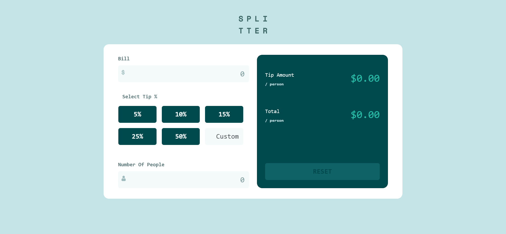

# Frontend Mentor - Tip calculator app solution

This is a solution to the [Tip calculator app challenge on Frontend Mentor](https://www.frontendmentor.io/challenges/tip-calculator-app-ugJNGbJUX). Frontend Mentor challenges help you improve your coding skills by building realistic projects.

## Table of contents

  - [The challenge](#Tip calculator app)
  - [Screenshot](#screenshot)
  - [Links](#links)
- [My process](#my-process)
  - [Continued development](#continued-development)
  - [Useful resources](#useful-resources)
- [Author](#author)
- [Acknowledgments](#acknowledgments)


### The challenge

Users should be able to:

- View the optimal layout for the app depending on their device's screen size
- See hover states for all interactive elements on the page
- Calculate the correct tip and total cost of the bill per person

### Screenshot




### Links

- Solution URL:(https://github.com/Cuthbertdeve1/TipCalculaterApp)
- Live Site URL: [Add live site URL here](https://your-live-site-url.com)

## My process

### Built with

- Semantic HTML5 markup
- CSS custom properties
- Flexbox
- Bootstrap


```html
  <button id="resetBtn" class="btn btn-reset w-100 mt-auto">RESET</button>
```
```css
input[type="text"]:hover {
  border: 2px solid hsl(172, 67%, 45%);
}
```
```js
resetBtn.addEventListener('click',()=>{
  resetTips();
})
```


## Author

- Website - (https://github.com/Cuthbertdeve1/)
- Frontend Mentor - [@Cuthbertdeve1](https://www.frontendmentor.io/profile/@Cuthbertdeve1)
- Twitter - [@cuthdeve](https://www.twitter.com/cuthdeve)
